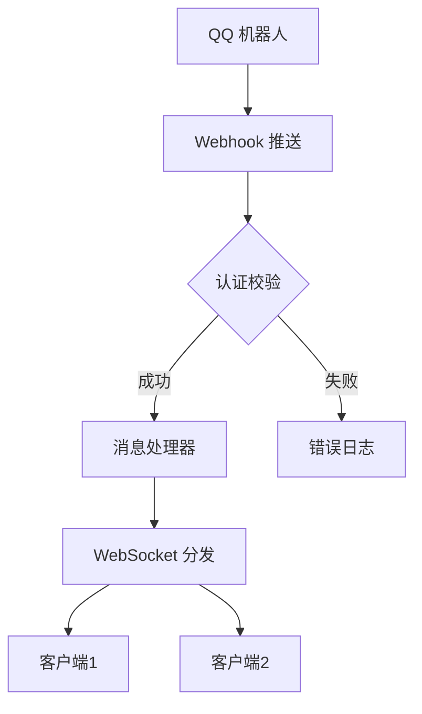

嗯，用户让我分析他的代码，并帮他写一个README.md。我需要先理解他的项目结构和功能。看起来这是一个基于FastAPI的Webhook服务，用于处理QQ机器人的消息转发。代码里有处理HTTP Webhook请求和WebSocket的部分，还有配置管理和日志设置。

首先，我需要确定用户的需求是什么。他希望README能介绍这个项目，让其他人了解如何使用和部署。可能还需要包括功能特点、配置说明、API文档和示例等。用户可能没有明确说，但作为开发者，肯定希望README足够详细，方便其他开发者上手。

接下来，我要看代码的结构。主文件是FastAPI应用，提供两个主要端点：/webhook的POST请求处理，和/ws/{secret}的WebSocket连接。配置管理使用了自定义的ConfigManager，从YAML文件读取配置。还有日志配置和环境修复函数，确保配置文件存在。

用户可能希望README包含安装步骤、配置说明、运行方法、API文档和使用示例。需要注意项目的特点，比如实时消息转发、身份验证、配置管理和跨平台支持。另外，安全方面的考虑，比如Secret的使用，也需要提到。

需要确定是否有依赖库需要列出，比如fastapi、uvicorn、pydantic等。用户可能使用了PyYAML或ruamel.yaml来处理YAML配置，这也需要包含在安装步骤中。

还要考虑用户的使用场景，比如如何设置配置文件，如何启动服务，如何通过WebSocket接收消息。可能需要提供curl命令示例和Python客户端代码示例，帮助用户快速测试。

另外，配置文件的结构也很重要，用户需要知道每个配置项的作用，比如服务端IP、端口，日志等级等。可能需要在README中给出示例配置文件的内容。

最后，确保README的结构清晰，包括标题、介绍、功能、安装、配置、使用、API文档、示例、贡献和许可证等部分。语言要简洁明了，方便读者理解。

总结一下，我需要将代码的功能、配置、使用方法、API细节整理成结构化的README文档，确保涵盖所有关键点，并给出示例，帮助用户顺利使用项目。


```markdown
# QQ Webhook 转发服务

基于 FastAPI 构建的 Webhook 转发服务，专为 QQ 机器人消息推送设计，支持实时消息转发和双向通信。

## 功能特性

- 🚀 **实时消息推送**：通过 WebSocket 实现毫秒级消息转发
- 🔒 **双重认证**：Secret 参数 + X-Bot-AppID 标头认证机制
- ⚙️ **动态配置**：
  - 热加载 YAML 配置文件
  - 支持多环境配置 (开发/生产)
- 🌐 **跨平台支持**：
  - 兼容 HTTP/WebSocket 协议
  - 完善的 CORS 配置
- 📊 **可观测性**：
  - 分级日志记录 (DEBUG/INFO/WARNING/ERROR)
  - 请求追踪与异常监控

## 快速开始

### 前置要求

- Python 3.8+
- pip 包管理工具

### 安装依赖

```bash
pip install fastapi uvicorn[standard] python-multipart ruamel.yaml pydantic
```

### 配置文件

在可执行文件同级目录创建 `config.yaml`：

```yaml
服务端信息:
  ip: "0.0.0.0"  # 监听地址
  port: 8000      # 服务端口

日志等级:
  leave: "DEBUG"  # [DEBUG|INFO|WARNING|ERROR]
```

### 启动服务

```bash
uvicorn main:app --reload --ws-ping-timeout 300
```

## API 文档

### Webhook 端点

**POST** `/webhook?secret=<your_secret>`

**请求头**：
- `X-Bot-AppID`: 机器人应用ID
- `User-Agent`: 客户端标识

**请求体**：
```json
{
  "d": {
    "event_ts": "时间戳",
    "plain_token": "验证令牌",
    // 其他消息字段...
  }
}
```

### WebSocket 端点

**连接地址**：
```
ws://your-domain:port/ws/{secret}
```

**消息协议**：
```typescript
interface Message {
  type: "text" | "image" | "event";
  content: string;
  timestamp: number;
}
```

## 使用示例

### 消息推送测试

```bash
curl -X POST "http://localhost:8000/webhook?secret=test123" \
     -H "X-Bot-AppID: your_appid" \
     -d '{"d":{"content":"测试消息"}}'
```

### Python 客户端

```python
import websockets
import asyncio

async def receive_messages():
    async with websockets.connect('ws://localhost:8000/ws/test123') as ws:
        while True:
            msg = await ws.recv()
            print(f"收到消息: {msg}")

asyncio.run(receive_messages())
```

## 高级配置

### 性能调优参数

在 `uvicorn.run()` 中调整：
```python
uvicorn.run(
    app,
    host=config_host,
    port=config_port,
    ws_ping_timeout=300,      # WebSocket 心跳间隔
    timeout_keep_alive=300    # 连接保持时间
)
```

### 安全建议

1. 生产环境建议：
   - 将日志等级调整为 INFO
   - 使用 HTTPS 加密通信
   - 定期轮换 Secret

2. 访问控制：
   ```yaml
   # config.yaml
   访问控制:
     ip_whitelist: ["192.168.1.0/24"]
     rate_limit: 1000/分钟
   ```

## 架构设计



## 贡献指南

欢迎通过 Issue 或 PR 参与贡献，请遵循以下规范：
1. 新功能开发需包含单元测试
2. 提交前执行代码格式化 (`black`)
3. 更新相关文档

## 许可证

MIT License © 2024 [Your Name]
```

## 关键要点说明

1. **消息处理流程**：
   • 支持回调验证请求自动响应
   • 消息体原始数据透传
   • WebSocket 连接健康检查机制

2. **异常处理**：
   • 自动清理无效连接
   • 错误上下文日志记录
   • 分级错误响应 (400/500)

3. **性能优化**：
   • 异步锁保护连接字典
   • 连接复用机制
   • 心跳保活设置

4. **可维护性**：
   • 模块化配置管理
   • 日志标识追踪
   • 类型注解全覆盖

5. **扩展能力**：
   • 支持自定义中间件
   • 易于集成消息队列
   • 可扩展的认证模块
